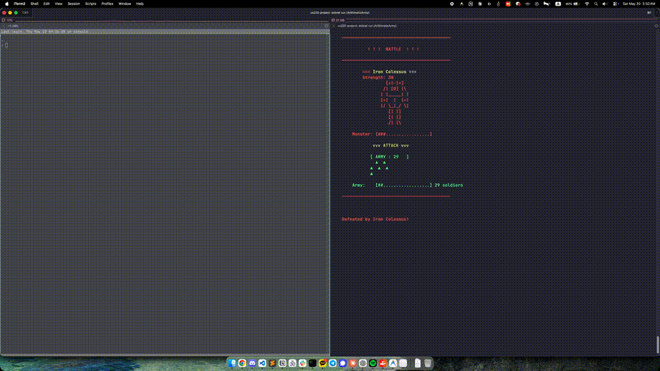

# Arithmetic Army

**Author:** Woosung Jeong (정우성) - 20250687

Arithmetic Army is a fast-paced decision-based CLI game implemented in F#. Your goal is to build the largest army possible by passing through optimal arithmetic gates and defeating various monsters, ultimately culminating in a battle against the Dragon Lord at Stage 15. It will not be easy to clear if you lack fast calculation skills and reaction speed. good luck.

## How to Run the Game

### Prerequisites
- **.NET 10 SDK** must be installed on your machine.
- A terminal or command prompt that supports standard ANSI escape sequences (most modern terminals like iTerm, macOS Terminal, Windows Terminal, or VSCode integrated terminal).

### Instructions
1. Open your terminal and navigate to the root directory of this project (where the `.fsproj` file is located).
2. Run the following command:
   ```bash
   dotnet run
   ```
3. Ensure your terminal window is sufficiently large (at least 80 columns wide and 40 lines high is recommended) to view the game properly.

### Controls

- A: Move to left lane
- D: Move to right lane
- Space: Immediately pass the current gate

---

## Gameplay Video



Full-quality video: [clear-video.mp4](./clear-video.mp4)
---

## Changes from the Original Proposal

There are **no major deviations** from the original requirements document submitted in the proposal. 
All 39 requirements—including the `max(2 + stageNumber / 2, soldiers / 8)` gap limit equation, the strict penalty flag system, and the dynamic gate falling speed—have been strictly adhered to and fully implemented. 

Minor visual adjustments (such as changing the map marker symbols from numbers to visual dots/symbols for better aesthetic distinction) were made strictly to improve user experience and do not violate any core mechanics or rules outlined in the proposal.

---

## LLM Usage Experience

While the core technical logic, F# functional structures, and game state management were implemented manually to ensure strict compliance with the project specifications, LLMs were heavily utilized for the aesthetic design, ASCII art generation, and UI/UX optimization.

### 1. ASCII Art Generation
Designing distinct, recognizable ASCII art for the 5 different monster tiers (Goblin Horde, Stone Golem, Arcane Swarm, Iron Colossus, Dragon Lord) manually would have been incredibly time-consuming. I utilized the LLM to generate these assets. By providing iterative prompts (e.g., *"Make the Stone Golem look heavier,"* *"Make the Dragon Lord even more magnificent"*), I was able to rapidly prototype and integrate high-quality ASCII art into the game.

### 2. Design & Color Palette Prompt Engineering
Finding the right color balance for a terminal game is challenging. Here is how I utilized the LLM to arrive at the final design:
- **Initial Prompt:** *"Update the design and add colors to the CLI game."*
  - *Result:* The LLM applied vivid 256-color ANSI codes with heavy background colors for the road lanes and gates. This caused severe visual clashing and made the text hard to read.
- **Refinement Prompt:** *"The colors clash too much. Remove the heavy background blocks. Use standard 16 ANSI colors so it matches the user's terminal theme, and replace solid block borders (▀) with clean line borders (┌─┐)."*
  - *Result:* The LLM successfully stripped away the clashing backgrounds, defaulting to a transparent background that fits any terminal theme (Dark/Light). The gates became sleek, framed boxes, and the army was redesigned using neat triangles (`▲`), vastly improving the game's readability and aesthetic.

### 3. Resolving Screen Flickering
- **Issue:** The terminal was clearing the screen (`Console.Clear()`) on every frame, causing severe flickering while the gates fell. Since the gate speed was hard-coded in the proposal requirements, I couldn't simply reduce the frame rate.
- **Prompt:** *"In the later stages of the game, when the gate descends quickly, the output keeps blinking, making it difficult to see the numbers. Is there a way to resolve this without reducing the speed?"*
- **Resolution:** The LLM suggested an elegant terminal trick: instead of clearing the screen, use `Console.SetCursorPosition(0, 0)` to overwrite the existing frame and `Console.CursorVisible = false` to hide the cursor during gameplay. This suggestion completely eliminated the flickering issue and resulted in buttery smooth animations.

### 4. Fixing Input Delay (Responsiveness)
- **Issue:** The game loop was initially structured to process inputs and render the screen only after completing a fixed sleep cycle for the gate movement. This created a noticeable visual delay when the user pressed the lane change keys (A/D).
- **Prompt:** *"I feel like there is an input delay when I move. Can we get rid of it without breaking the gate speed rules?"*
- **Resolution:** The LLM helped completely refactor the game loop to decouple the rendering logic from the logical gate timer. By polling input every 2ms and immediately re-rendering the screen upon a lane change (0 delay response), while tracking the strict gate drop speed on an independent timer, the game's controls became incredibly responsive and arcade-like.